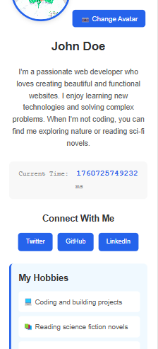
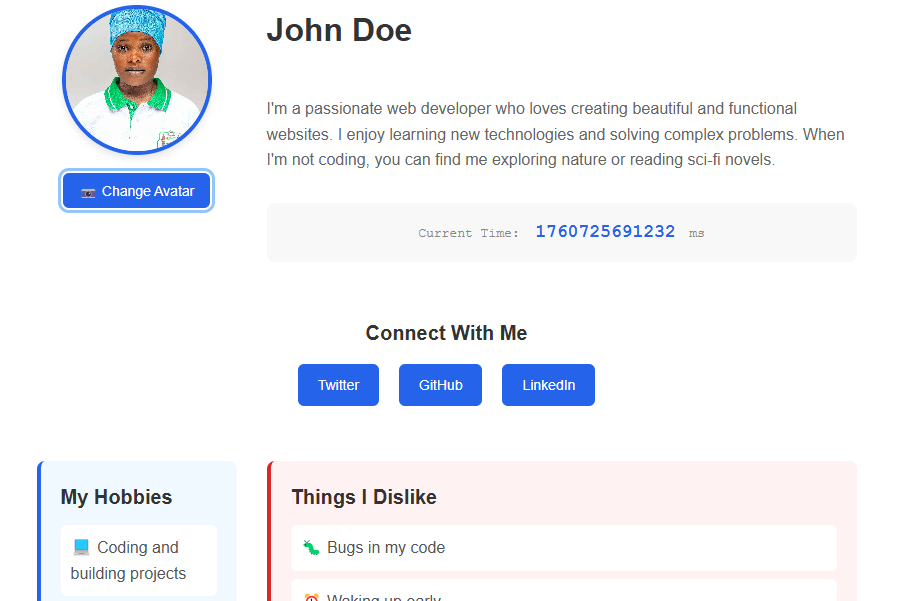

# Profile Card Project

A responsive, accessible profile card component built with HTML, CSS, and vanilla JavaScript, now extended with **multi-page functionality** for Stage 1.

---

## 🌟 Features

- ✅ Semantic HTML structure
- ✅ Fully responsive (mobile, tablet, desktop)
- ✅ Accessible (WCAG compliant)
- ✅ Live current time display
- ✅ Image upload functionality
- ✅ Smooth animations and transitions
- ✅ Keyboard navigation support
- ✅ Multi-page setup: Profile, Contact Us, About Me
- ✅ Contact form with validation
- ✅ Reflective About Me page

---

## 🚀 Live Demo

[Live Demo](https://stage0-profile-card.netlify.app/)

_(Stage 1 pages available through navigation links in the header)_

---

## 📸 Screenshots

### Mobile View



### Desktop View



---

## 🛠️ Technologies Used

- HTML5 (Semantic markup)
- CSS3 (Flexbox, Grid, Media Queries)
- Vanilla JavaScript (ES6+)

---

## 📋 Required Elements (Stage 0)

All elements include proper `data-testid` attributes for testing:

- ✅ `test-profile-card` - Main container
- ✅ `test-user-name` - User's name
- ✅ `test-user-bio` - Biography
- ✅ `test-user-time` - Current time in milliseconds
- ✅ `test-user-avatar` - Profile image
- ✅ `test-user-social-links` - Social media links container
- ✅ `test-user-hobbies` - Hobbies list
- ✅ `test-user-dislikes` - Dislikes list

---

## 📋 Required Elements (Stage 1)

### Contact Us Page (`contact.html`)

- `test-contact-name` — Full name input
- `test-contact-email` — Email input
- `test-contact-subject` — Subject input
- `test-contact-message` — Message textarea
- `test-contact-submit` — Submit button
- `test-contact-error-<field>` — Field-specific error messages
- `test-contact-success` — Success message after valid submission

**Validation Rules**

- All fields required
- Email must be valid
- Message must be ≥ 10 characters

---

### About Me Page (`about.html`)

- `test-about-bio` — Personal bio
- `test-about-goals` — Goals in the program
- `test-about-confidence` — Areas of low confidence
- `test-about-future-note` — Note to future self
- `test-about-extra` — Extra thoughts

**Semantic Structure**

- `<main data-testid="test-about-page">`
- `<section>` for each area with proper headings (`<h2>`, `<h3>`)

---

## 🎨 Responsive Breakpoints

- **Mobile:** < 768px
- **Tablet:** 768px - 1023px
- **Desktop:** ≥ 1024px

---

## ♿ Accessibility Features

- Semantic HTML5 elements
- ARIA labels and roles
- Keyboard navigation support
- Focus indicators on interactive elements
- Alt text on images
- Screen reader friendly
- Form inputs linked with labels
- Error messages tied with `aria-describedby`

---

## 🔧 Local Setup

1. Clone this repository:

```bash
git clone https://github.com/YOUR_USERNAME/profile-card.git
```

2. Navigate to project folder:

```bash
cd profile-card
```

3. Open any page in your browser:

```bash
# On Mac
open index.html
open contact.html
open about.html

# On Windows
start index.html
start contact.html
start about.html
```

---

## 📁 Project Structure

```
profile-card/
│
├── index.html          # Profile Card (Stage 0)
├── contact.html        # Contact Us Page (Stage 1)
├── about.html          # About Me Page (Stage 1)
├── styles.css          # Shared styling
├── script.js           # JS for profile card, contact form, live time
└── README.md
```

---

## 🧪 Testing

**Stage 0**: Profile card

- [ ] Profile card displays correctly on mobile, tablet, desktop
- [ ] Current time updates every second
- [ ] Image upload works and previews correctly
- [ ] All social links open in new tabs
- [ ] Keyboard navigation works
- [ ] Focus indicators and hover effects work

**Stage 1**: Multi-page

**Contact Us Page**

- [ ] All required fields exist and use correct `data-testids`
- [ ] Validation prevents invalid submissions
- [ ] Success message only shows after valid submission

**About Me Page**

- [ ] All required sections exist with correct `data-testids`
- [ ] Semantic HTML used (`main`, `section`, `ul`, `p`, `h2`)

**General**

- [ ] Fully responsive across mobile, tablet, desktop
- [ ] Accessible (labels, alt text, ARIA associations)
- [ ] Keyboard navigable

---

## 📝 Customization

1. Update personal info in `index.html`, `about.html`, and `contact.html`.
2. Replace social media URLs and modify hobbies/dislikes.
3. Change colors in `styles.css` (Primary: `#2563eb`, Accent: `#dc2626`, Background: `#f0f0f0`).
4. Upload your own avatar for the profile card.

---

## 🚀 Deployment

This project can be deployed to:

- Netlify
- GitHub Pages
- Vercel
- Any static hosting service

---

## 📄 License

Open source, educational purposes.

---

## 👤 Author

Naana Shifah - [Your GitHub](https://github.com/Anonymous2024-spec/)

---

## 🙏 Acknowledgments

- Built as part of Stage 0 & Stage 1 training
- Inspired by modern profile card designs and multi-page accessibility guidelines
